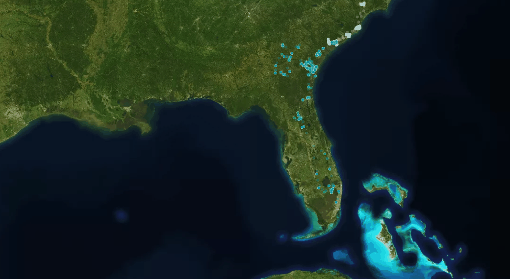

To cite this material

# [Wildlife Tracker Gallery-v0.2](www.gis4-wildlife.com/gallery)

Normalized visualization with yearly code in 17 individuals of Wood Stork (M. americana) during 13 years (2016-2019) | Understanding big data limitation for Wildlife Tracker

Basille M, Borkhataria RR, Bryan AL, Bucklin DN, Picardi S, Frederick PC (2021) Data from: Study "Wood stork (Mycteria americana) Southeastern US 2004–2019". Movebank Data Repository. [doi:10.5441/001/1.r0h6725k](doi:10.5441/001/1.r0h6725k)

Galápagos albatrosses with stop detection algorithm (movingpandas) as Kernel Density weighted by stop's duration 

Dodge et al, 2013. The Environmental-Data Automated Track Annotation (Env-DATA) System. Movebank  [doi:10.5441/001/1.3hp3s250](doi:10.5441/001/1.3hp3s250)

